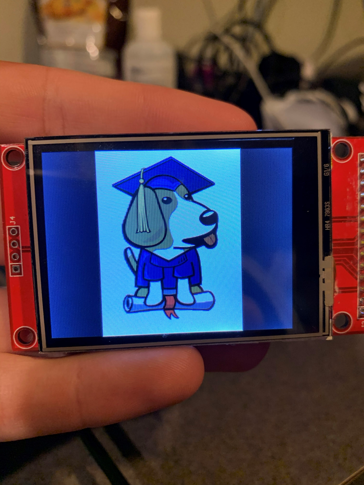
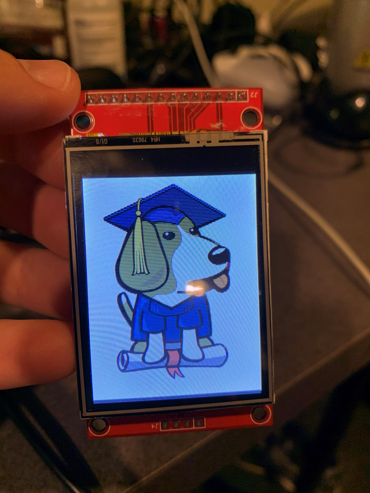
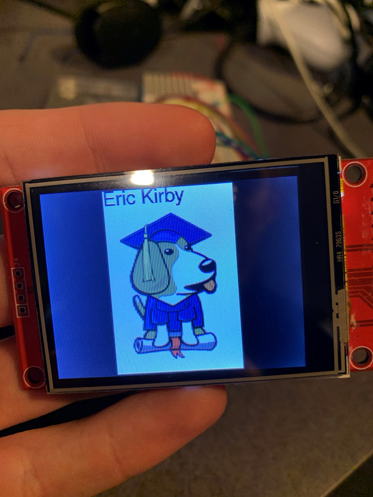

# Homework 4
## Memory Map

This is a memory map for the BeagleBone Black. It specifically marks the four GPIO ports and 
the starting and ending address of EMIF0 SDRAM.

## mmap
1. `switchesAndLEDs.py` reads two switches by using mmap from two different ports GPIO0 and GPIO1.
The buttons are assigned to pins P9_13 and P9_15. The LEDS are USR1 and USR3.
To run this, `chmod +x switchesAndLEDS.py` then `sudo ./switchesAndLEDs.py`.

2. To toggle the GPIO port there is a toggle program, which is `toggle.py`. It toggles pin P9_14. 
To run this, `chmod +x toggle.py` then `sudo ./toggle.py.

An oscilliscope was used to measure the frequency, which was found to be 91.1KHz.
!(Oscilliscope)[osci.jpg]

## Kernel Driver
`kernelDriver.sh` is a kernel driver that reads the temperature sensors. 
To run this, `chmod +x kernelDriver.sh`

## Flask and Etch-A-Sketch
This program is an Etch-A-Sketch on the LED Matrix and it is controlled by a Flask webpage.
To run this, `chmod +x etchASketch.py` then `./etchASketch.py`. The webpage will then be at `192.168.7.2:8081`

## LCD Display
The LCD is connected on SPI1

Boris displayed on the LCD:

To run this, `./on.sh` then `sudo fbi -noverbose -T 1 -a boris2.png`

Boris rotated on the LCD:

To run this, go into `on.sh` and change `rotate=180` then run `./on.sh` then `sudo fbi -noverbose -T 1 -a boris2.png`

To run the movie, run `./on.sh` `mplayer -vo fbdev2:/dev/fb0 -framedrop hst_1.mpg`

Boris with text on the LCD:

  