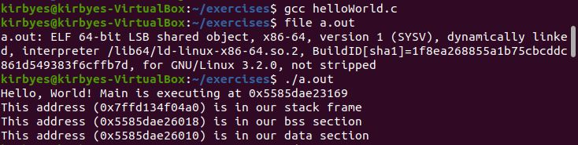
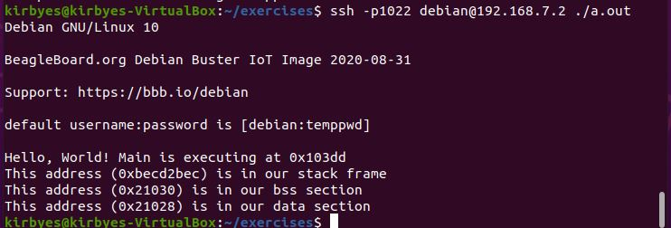

# Homework 5
## Make
I completed the exercise. `cd makefile` to get to the make files. Use `make` to create the executable.
The answers to the questions are as follows:
* 1.) Target = app.o
* 2.) Dependency = app.c
* 3.) Command = gcc
* 4.) -c says not to run the linker

## Cross-Compiling
I have attached the output of the cross-compile below:

This is the output of helloWorld.c from the host.

This is the output of the helloWorld.c on the bone.

## Kernel Modules
### gpio_test
The first part of gpio_test can be found in the gpio_test folder. This uses a button connected to P9_15 to turn an LED connected to 
P9_16 on and off. To use it, first make it using `make` then insert the module into the kernel using `sudo insmod gpio_test.ko`. 
Once you are done, you can remove the module from the kernel using `sudo rmmod gpio_test`.

The second part of gpio_test can be found in the gpio_test2 folder. This uses two buttons, one connected to P8_15 and one connected
to P8_18, to control two LEDs, one connected to P9_12 and one connected to P9_14. To use it, first make it using `make` then insert 
the module into the kernel using `sudo insmod gpio_test.ko`. Once you are done, you can remove the module from the kernel using 
`sudo rmmod gpio_test`.

### led
This part of the assignment can be found in the led folder. This blinks two LEDs, one connected to P9_23 and one connected to P9_25
at different rates. To use it, first make it using `make` then insert the module into the kernel using `sudo insmod led.ko`. 
Once you are done, you can remove the module from the kernel using `sudo rmmod led`.
