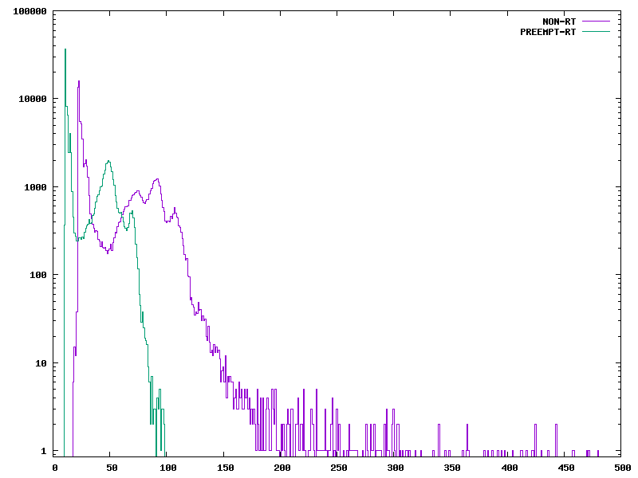

# Homework 6
## Watch
* 1.) She works at National Instruments.
* 2.) PREEMPT_RT is a patch that makes Linux into a real-time system. This 
means that it gives you faster response times and removes all unbounded
latencies compared to the normal kernel.
* 3.) Embedded Systems that run two types of tasks. Tasks that require real
time requirements and then tasks that aren't time critical. These may need 
to run together and even communicate with eachother.
* 4.) The driver stacks are shared between the two systems. This can make
the drivers misbehave. This means that if the drivers deal with interrupts
then you aren't able to thread.
* 5.) The delta stands for latency, which is the difference between the
time an exernal event occurs and the time the relavent real time task 
actually executes.
* 6.) Cyclictest measures the time difference between when a thread is 
supposed to wake up compared to when the thread actually wakes up. It does
this repeatedly.
* 7.) Figure 2 shows the histograms for the Cyclictest run using the 
regular config PREEMPT in a mainline kernel and then using PREEMPT_RT on the 
same hardware system. The regular PREEMPT is shown in purple and the 
PREEMPT_RT is seen in green.
* 8.) Dispatch latency is the time it takes the hardware event firing to
desired thread to actually be woken up by the scheduler. Scheduling latency
is the time it takes between the scheuler to wake up the thread and the CPU
being given the task to actually execute.
* 9.) The mainline model has long running interrupts. Interrupt handlers are
executed in hardirq context and they are run with interrupts disabled.
* 10.) It is a low priority interrupt. This moves the computer into hard
interrupt context and starts to run the handler for that interrupt. 
* 11.) RT keeps most things from running in hardirq. This means that 
whenever a higher priority interrupt occurs, it can run right away.

## PREEMPT_RT

Response times with no load

Response times with a load

From the plot, it looks like the RT kernel does have a bounded latency of 
about 100 microseconds.
For the load I was running a basic makefile and switching between `make` and
`make clean`.
