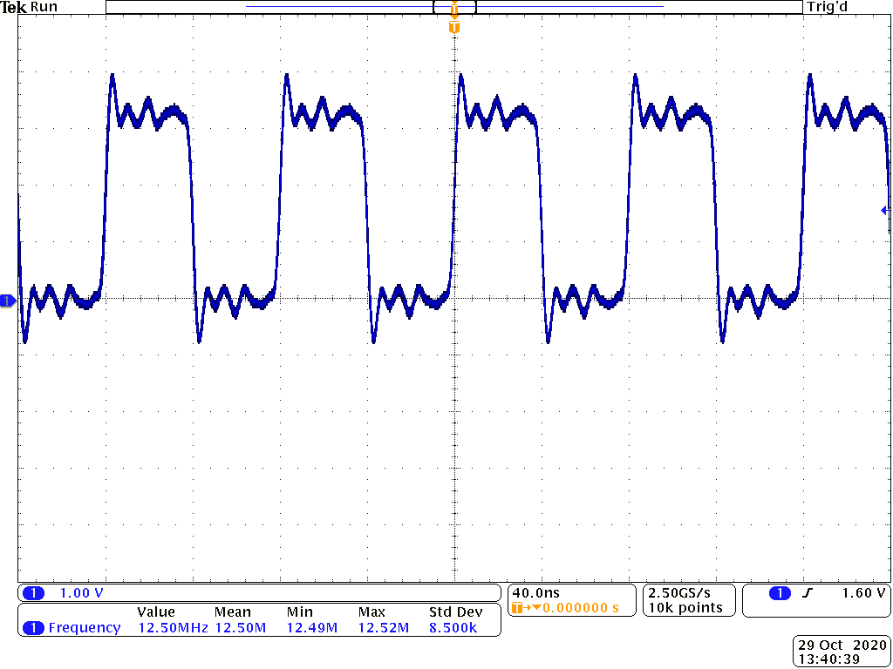
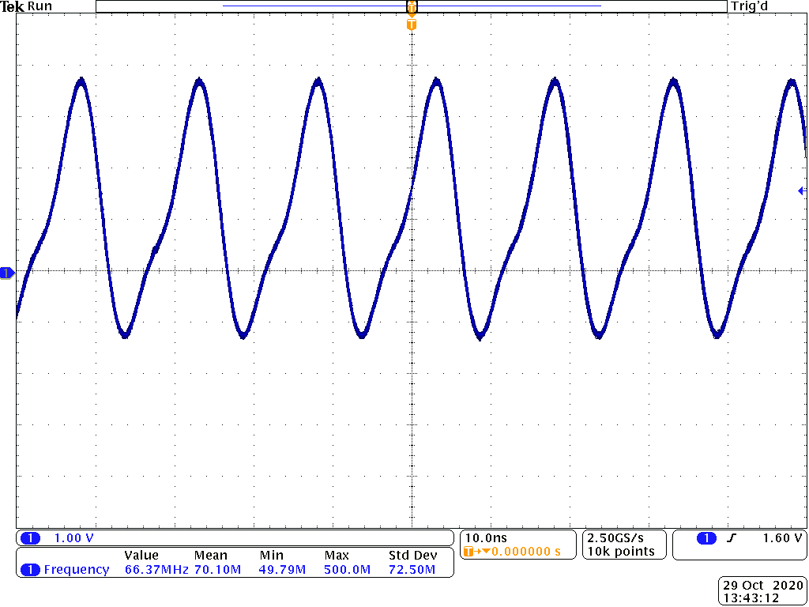
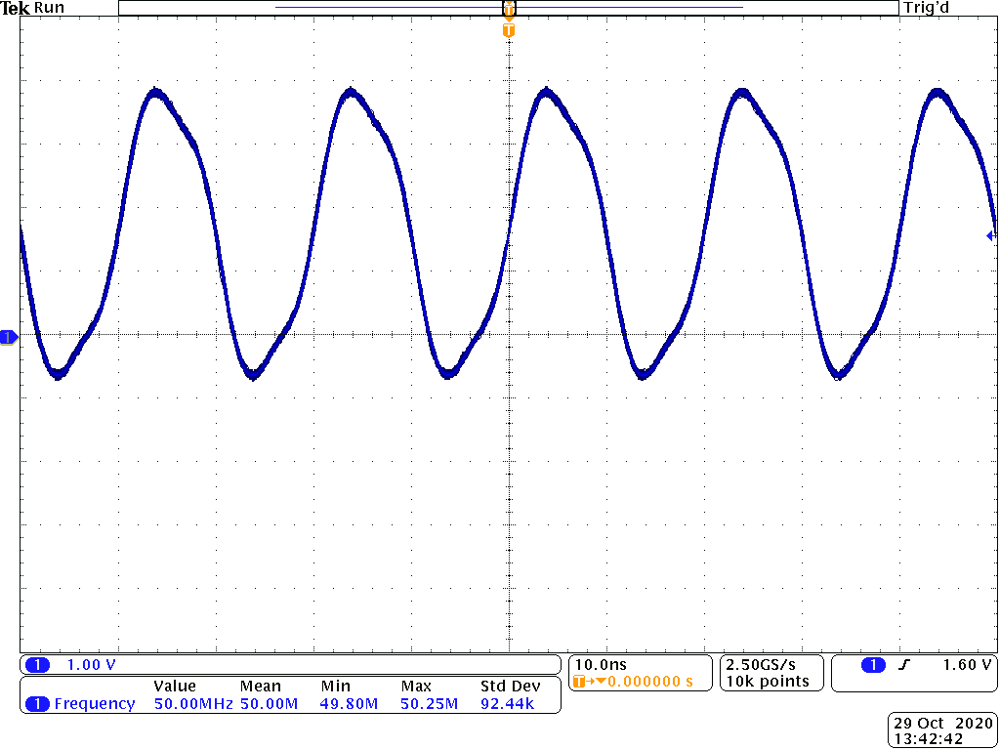
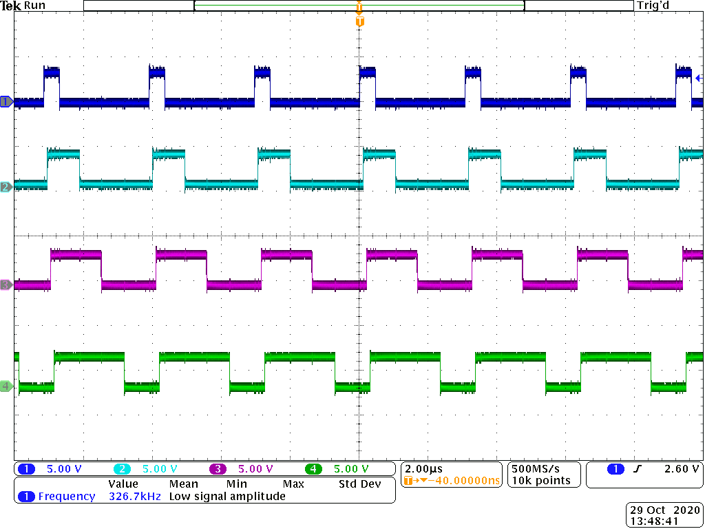
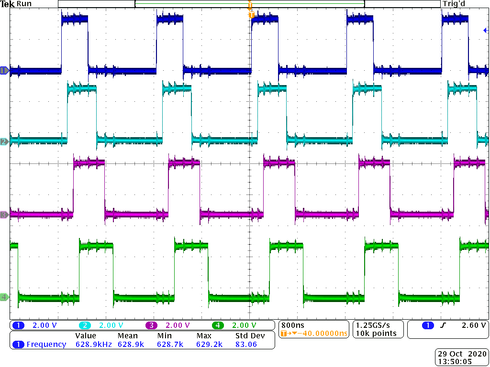
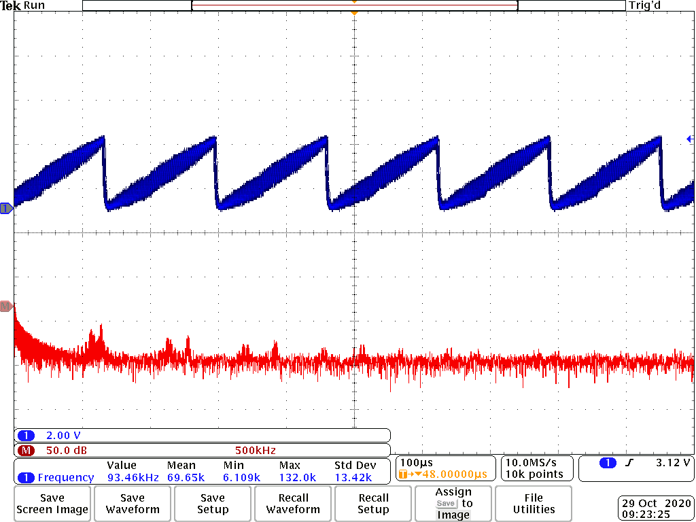
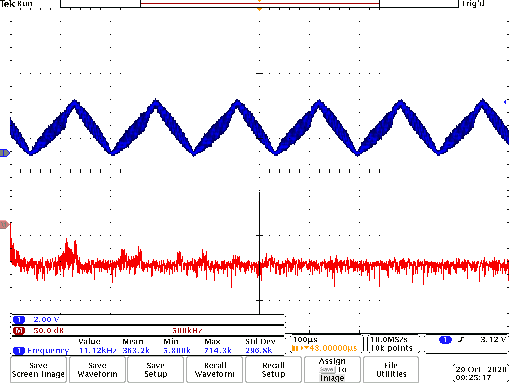
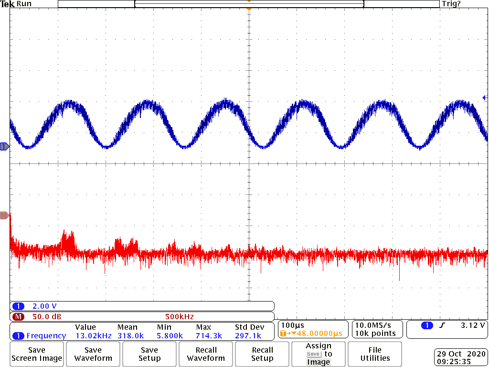

# Homework 8
Table 1: Frequency Comparison
|   | Frequency |
|---|---|
| ARM GPIO | 12.5 MHz |
| PRU | 66MHz |
| 4 PWM Channels | 630 kHz |

## Blinking an LED
`make start` will start the PRU and `make stop` will stop the PRU.
It is running at 12.5 MHz.
It is a jittery function. There is a lot of overshoot on the square wave when it transitions from high to low.

Figure 1: Toggling P9_31 as fast as possible using ARM GPIO

## PWM Generator
The PRU is able to oscillate at 66MHz, which is much faster than the ARM GPIO is able to.
Figure 2 is a steady signal, but it is switching so fast that it doesn't look like a square wave anymore.
In Figure 3, the PRU is oscillating at 50 MHz. It is stable and represents a sine wave.
The standard deviation of Figure 3 is 92.44k.

Figure 2: Toggling P9_31 as fast as possile using the PRU

Figure 3: Toggling P9_31 at 50 MHz using the PRU

## Controlling the PWM Frequency
Bits 0-3 of __R30 are being used. Thes correspond to P9_31, P9_29, P9_30, and P9_28.
I was able to get the four channels up to 630 kHz.
There is some jitter in this signal. It isn't as smooth as past signals have been.
I was able to control the on and off times of the signals with `pwm-test.c`. When I ran pwm-test.c 
again it changed the on and off times of the signal.

Figure 4: Using the given code to toggle the 4 PWM channels

Figure 5: Toggling the 4 PWM channels as fast as possible

## Reading an Input at Regular Intervals
It takes about 30ns for the signal to get from the input to the output.

Figure 6: With an input a of a square wave with a frequency of 12 MHz using a function generator, this is the output.

## Analog Wave Generator
Results are below for the analog wave generator.
I used a 0.22 pF capacitor and 600 ohm resistor to generate the plots below. 

Figure 7: Sawtooth Output

Figure 8: Triangle Output

Figure 9: Sine Output