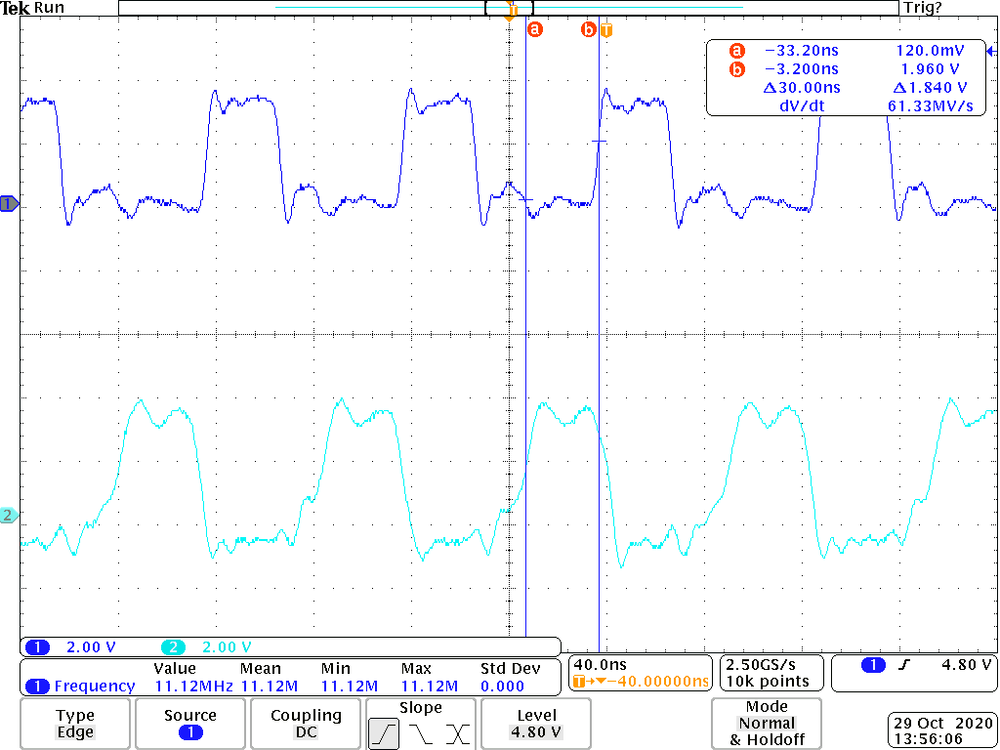

# Homework 8
## Blinking an LED
`make start` will start the PRU and `make stop` will stop the PRU.

Figure 1: Toggling P9_31 as fast as possible using ARM GPIO

## PWM Generator

Figure 2: Toggling P9_31 as fast as possile using the PRU

Figure 3: Toggling P9_31 at 50 MHz using the PRU

## Controlling the PWM Frequency
Bits 0-3 of __R30 are being used. Thes correspond to P9_31, P9_29, P9_30, and P9_28.

Figure 4: Using the given code to toggle the 4 PWM channels

Figure 5: Toggling the 4 PWM channels as fast as possible

## Reading an Input at Regular Intervals

Figure 6: With an input a of a square wave with a frequency of 12 MHz using a function generator, this is the output.

## Analog Wave Generator

Figure 7: Sawtooth Output

Figure 8: Triangle Output

Figure 9: Sine Output