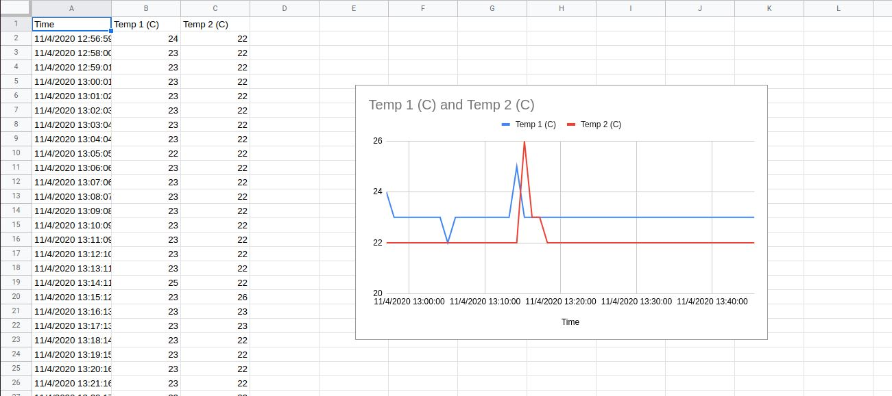
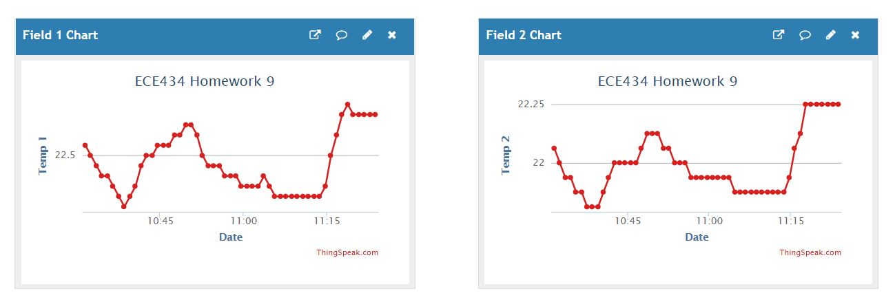

# hw09 grading

| Points      | Description |
| ----------- | ----------- |
|  5 | Project Timeline
| 10 | Logging to Sheets
|  3 | Logging to ThingSpeak - optional
|  2 | Extras
| 20 | **Total**

*My comments are in italics. --may*

# Homework 9
## Logging in Sheets
To run the program, first run `./setup.sh` then run `sheetsLogTemp.py`. 

My sheet can be found [here.](https://docs.google.com/spreadsheets/d/1nqkfb2mj2ONiOz9udQsRrPbfCV2_YJTuQHcWcPSO190/edit?usp=sharing)

## Logging to Thingspeak
To run the program, run `./temp.py`.

My output for Thingspeak can be found [here.](https://thingspeak.com/channels/1218557)

